# Experimental Modeling and Control of Multi-Agent System (University of Washington)
This work was carried out under the guidance of Professor [Santosh Devasia]((https://www.me.washington.edu/facultyfinder/santosh-devasia)) and then PHD student [Anuj Tiwari](https://mech.iitm.ac.in/profile.php?fname=anujt) at the University of Washington, in Summer of 2018. Detailed report can be found [here](https://drive.google.com/file/d/1YZ9jwvAxSkL1Ajf-2Ejj4XCATk1ZQ6S7/view). 

# Introduction
This work aims to find strategies to efficiently transfer velocity-transition information through a robotic platoon without centralized communication, which is crucial for maintaining cohesive maneuvers and improving performance. 

# Experimental Setup Preparation
The aim was to experimentally estimate the system dynamics (PWM vs velocity)
for robot-cars, and linearise it to apply linear control theory. We hope that system has first-order dynamics and can be represented as:     

   
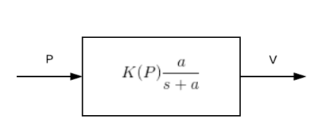
- where $P$ is commanded PWM
-  V  is Velocity

# Observations from Step Response
  
- The system dynamics are fast (very low time constant value ~ 0.1 s).   
- Steady state gain (Velocity vs PWM) is non linear, as shown in the following graph.   
  
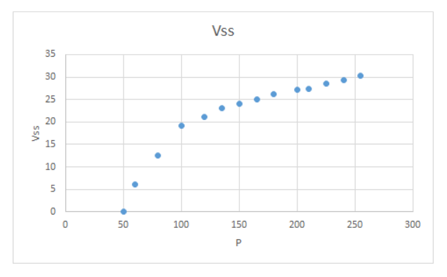

# Linearising the system
We implement an additional gain ($\frac{\hat{k}}{K(P)}$) in the software code, before commanding the PWM as:  
  

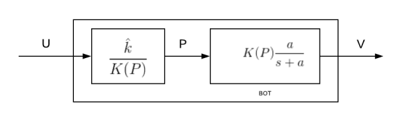   
which linearises the system as:    

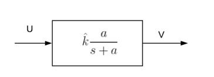  

# Introducing sluggish dynamics
We add an LPF to replicate sluggish dynamics of real world systems. The value can be chosen depending on the kind of systems one wants to test control strategies on. (can be high for trucks, lower for cars, and very low for racing cars). This can be shown schematically as:

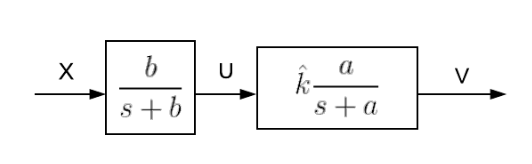  

If b << a, then system can be approximated as a linear first order system with dynamics driven by $b$ only. 

# Closed Loop architecture

The control law used for validation is given by:

$$
X = c \cdot (d - d_0) \tag{7}
$$

Where:
- $d$ is the relative distance measured by the ultrasonic sensor.
- $d_0$ is the desired headway (15 cm for our experiments).
- $c$ is the gain, which can be adjusted based on the experiments performed.
- $a$ ~ 10, derived from step response experiments of PWM vs velocity.
- $b = 2$ for experiments mentioned here, although results are similar for lower values of $b$

Schematic representing closed loop dynamics is as:

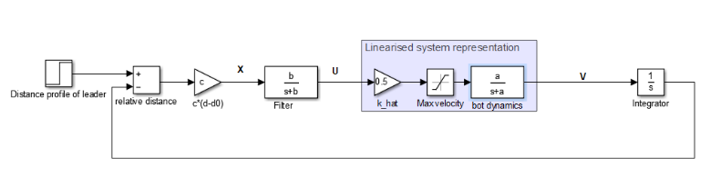  

# Experimental validation  
 
## Initial Conditions 1

-  $d$ = 50 cm  ,  $d_0$ = 15 cm ,  $c$ is as per graph's title  
      
(The follower is kept behind the leader at a distance of 50 cm, and the leader does not move in the experiment.)

The graph shows the variation of relative distance $d$ with time.    

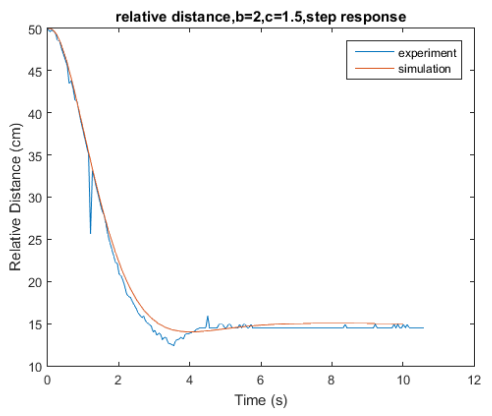

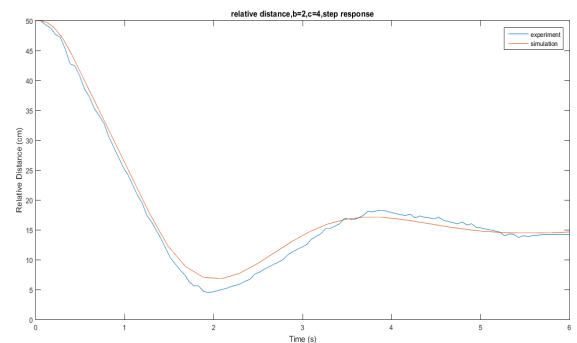

**Experimental results seem to match closely with simulations, hence our system model seems accurate.**

## Initial Conditions 2

-  $d$ = 15 cm, $d_0$ = 15 cm, $c$ is as per graph's title     

- The leader bot is given a velocity of 24.5 cm/s for 4 seconds and then comes to a stop at $t=4$ s (as shown below)
  
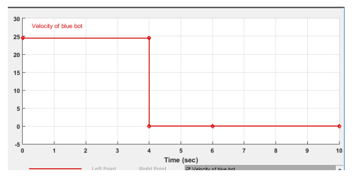

- The follower starts with a velocity of 0, with $d - d_0$ = 0 cm.    

The graph shows the variation of relative distance $d$ with time.     

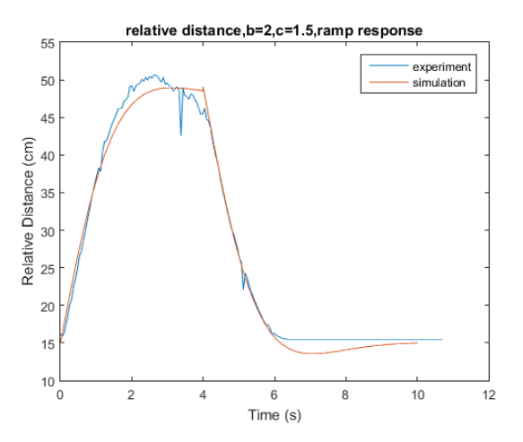

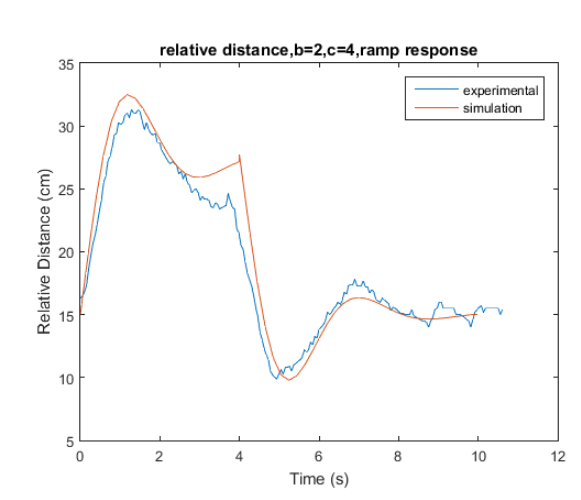

**Since simulations and experimental results match, it seems we have modelled and linearised system dynamics. We will test multi-agent control strategies now.**
## Initial Conditions 3:

We use conditions mentioned above in **Initial Conditions 2** , such that leader starts moving suddenly as [here](Leader_bot.png)
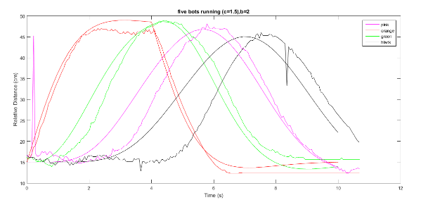

### Observations
The deviation from simulation propagates over the chain of bots, and delay in information transfer/loss of cohesion is more than that estimated by the simulation. We will theoretically evaluate our control strategies on our approximate model, and experimentally validate if our conclusions are correct.

# Improved cohesion by increasing ${\hat{k}}$

${\hat{k}}$ = 1  
  
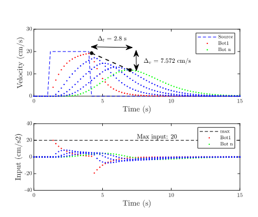
  
${\hat{k}}$ = 1.5 
   

Cohesion improves with reduction in peak velocity difference. However, this improvement is at the cost of increasing the maximum input $(u_max)$ from 20 $cm/s^2$ to 30 $cm/s^2$. **Therefore, constraints on the maximum input can limit the maximum improvement in cohesion achievable by increasing ${\hat{k}}$.**
  

#Further research was carried out by Anuj and led to this [paper](https://ieeexplore.ieee.org/document/9123234)

