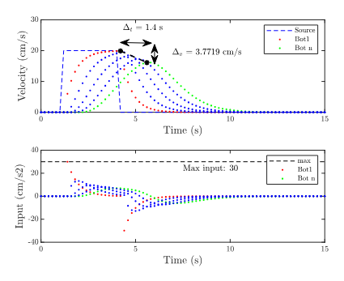

# Experimental Modeling and Control of Multi-Agent System (University of Washington)
This work was carried out under the guidance of Professor [Santosh Devasia]((https://www.me.washington.edu/facultyfinder/santosh-devasia)) and then PHD student [Anuj Tiwari](https://mech.iitm.ac.in/profile.php?fname=anujt) at the University of Washington, in Summer of 2018. Detailed report can be found [here](https://drive.google.com/file/d/1YZ9jwvAxSkL1Ajf-2Ejj4XCATk1ZQ6S7/view). 

# Index

1. [Introduction](#introduction)
2. [Modelling the Experimental setup](#modelling-the-experimental-setup)
    - [Observations from Step Response](#observations-from-step-response)
    - [Linearising the System](#linearising-the-system)
    - [Introducing Sluggish Dynamics](#introducing-sluggish-dynamics)
    - [Closed Loop Architecture](#closed-loop-architecture)
    - [Model Validation](#model-validation)
      - [Initial Conditions 1](#initial-conditions-1)
      - [Initial Conditions 2](#initial-conditions-2)
      - [Initial Conditions 3](#initial-conditions-3)
    - [Conclusions from validation](#conclusions)
3. [Improved Cohesion by Increasing ${\hat{k}}$](#improved-cohesion-by-increasing-k)
4. [A-DSR implementation](#a-dsr-based-implementation)
5. [Theoretical Analysis](#theoretical-analysis)
6. [Further Research](#further-research)

# Introduction
This work aims to find strategies to efficiently transfer velocity-transition information through a robotic platoon without centralized communication, which is crucial for maintaining cohesive maneuvers and improving performance. 

# Modelling the Experimental Setup
The aim was to experimentally estimate the system dynamics (PWM vs velocity)
for robot-cars, and linearise it to apply linear control theory. We hope that system has first-order dynamics and can be represented as:     

   

- where $P$ is commanded PWM
- $ V $ is Velocity

## Observations from Step Response
  
- The system dynamics are fast (very low time constant value ~ 0.1 s).   
- Steady state gain (Velocity vs PWM) is non linear, as shown in the following graph.   
  

## Linearising the system
We implement an additional gain ($\frac{\hat{k}}{K(P)}$) in the software code, before commanding the PWM as:  
  

   
which linearises the system as:    

  

## Introducing sluggish dynamics
We add an LPF to replicate sluggish dynamics of real world systems. The value can be chosen depending on the kind of systems one wants to test control strategies on. (can be high for trucks, lower for cars, and very low for racing cars). This can be shown schematically as:

  

If b << a, then system can be approximated as a linear first order system with dynamics driven by $b$ only. 

## Closed Loop architecture

The control law used for validation is given by:

$$
X = c \cdot (d - d_0) 
$$

Where:
- $ d$ is the relative distance measured by the ultrasonic sensor.
- $d_0$ is the desired headway (15 cm for our experiments).
- $ c $ is the gain, which can be adjusted based on the experiments performed.

Schematic representing closed loop dynamics is as:

  

- where $a$ ~ 10, derived from step response experiments of PWM vs velocity.
- $b = 2$ for experiments mentioned here, although results are similar for lower values of $b$

# Model validation
 
## Initial Conditions 1

-  $d$ = 50 cm  ,  $d_0$ = 15 cm ,  $c$ is as per graph's title  
      
(The follower is kept behind the leader at a distance of 50 cm, and the leader does not move in the experiment.)

The graph shows the variation of $d$ with time.    

**Experimental results seem to match closely with simulations, hence our system model seems accurate.**

## Initial Conditions 2

-  $d$ = 15 cm, $d_0$ = 15 cm, $c$ is as per graph's title     

- The leader bot is given a velocity of 24.5 cm/s for 4 seconds and then comes to a stop at $t=4$ s (as shown below)
  

- The follower starts with a velocity of 0, with $d - d_0$ = 0 cm.    

The graph shows the variation of $d$ with time.     

**Since simulations and experimental results match, it seems we have modelled and linearised system dynamics. We will test multi-agent control strategies now.**
## Initial Conditions 3:

We use conditions mentioned above in **Initial Conditions 2** , such that leader starts moving suddenly as [here](Leader_bot.png)

## Conclusions
- There is greater loss of cohesion in experiments than simulation. This can be because of delays in individual bot-leader dynamics, which sum up at the last bot\ unconsidered dynamics due to sampling time = 0.2 seconds
- We propose using this linear model to theoretically evaluate control strategies. The evaluated control strategy when implemented on our test setup should show similar improvements.
- Since time constant is a very low value, the system can be also approximated as a zero-order system, for analysing control strategies.
# Improved cohesion by increasing k 
For ease of analysis we assume the system to be zero-order,  i.e. b = \infty

${\hat{k}}$ = 1  , c =1
  

  
${\hat{k}}$ = 1.5 , c = 1
   

Cohesion improves with reduction in peak velocity difference. However, this improvement is at the cost of increasing the maximum input $(u_max)$ from 20 $cm/s^2$ to 30 $cm/s^2$. **Therefore, constraints on the maximum input can limit the maximum improvement in cohesion achievable by increasing ${\hat{k}}$. We cannot use diffusion control equations ($X = c \cdot (d - d_0)$) for fast information transfer, within system's constraints** 
  

## A-DSR based implementation
The control law is modified as:

$$
v_i[m + 1] = v_i[m] - k*(v_i[m]-v_{i+1}[m]) \delta t + \beta \left(v_i[m] - v_i[m - 1]\right).
$$

which translates to pde described by the wave equation:

$$
\beta\delta t\frac{\partial^2 v}{\partial t^2} + (1-\beta) \frac{\partial v}{\partial t} = \frac{\gamma c^2}{(2D)} \nabla^2 v
$$    

where $c$ is the average distance to the neighbors, X represents the
spatial location of agents, D is the number of dimensions of the
spatial variable X over which the information $v$ is varying.[(link)](https://faculty.washington.edu/devasia/Research/Papers/Devasia_Swarm_Control.pdf)

The experimental results show quick transfer of velocity information in the platoon, even when inputs are constrained $(20 cm/s^2)$. 

<table>
  <tr>
    <td><strong>WITH DSR</strong></td>
    <td><strong>WITHOUT DSR (&beta; = 0)</strong></td>
  </tr>
  <tr>
    <td></td>
    <td></td>
  </tr>
</table>

# Theoretical analysis

**Without DSR**

$$
\frac{\partial v(t)}{\partial t} = \frac{\gamma c^2}{(2D)} \nabla^2 v(t)
$$

**With DSR**

$$
\beta\delta t\frac{\partial^2 v}{\partial t^2} + (1-\beta) \frac{\partial v}{\partial t} = \frac{\gamma c^2}{(2D)} \nabla^2 v
$$    

**Poles without DSR**

For a field with some boundary conditions in x, the poles are given by      

$$s_i + \gamma {\lambda_i} = 0$$     

The settling $T_{s,i}$ time can be approximated as      

$$
T_{s,i} = \frac{4}{|s_i|} = \frac{4}{\gamma \lambda_i}
$$

**Poles with DSR**

For the same boundary conditions in x as above, the poles are given by    

$$s^2 + \frac{(1 - \beta)}{\beta\delta_t }s + \frac{\gamma {\lambda_i}}{\beta \delta_t} = 0$$

or     

$$s^2 + 2 \zeta_i \omega_i s + \omega_i^2 = 0$$

where      

$$\omega_i = \sqrt{\frac{\gamma\lambda_i }{\beta \delta_t}}$$

and         

$$2 \zeta_i \omega_i = \frac{(1 - \beta)\gamma\lambda_i }{\beta \delta_t}$$

Assume critically damped systems to ensure no oscillations during information transfer,
i.e. $\zeta_i = 1$        

$$
\beta = (1 + 2\gamma \delta_t \lambda_i) - \sqrt{(1 + 2\gamma \delta_t \lambda_i)^2 - 1}
$$

$$
\hat T_{s,i} = \frac{4}{\omega \zeta} = 2*\sqrt{\beta \delta_t T_{s,i}}
$$

where              
 0< $\beta$ <1  and $\delta_t$ can be as low as zero.            

Hence DSR based control laws ensure low settling times without oscillations, compared to diffusion based control laws

# Further Research
Further analysis needs to be done to evaluate string stability of such control laws.
